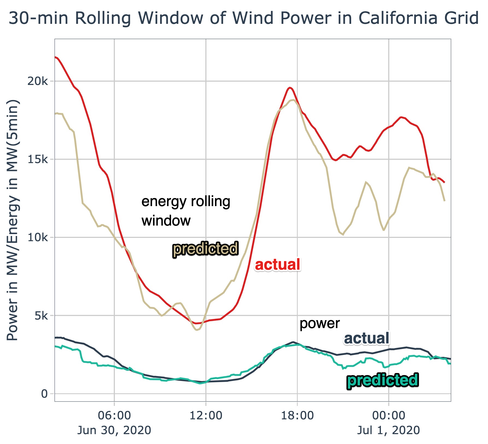

# CAISO Wind Energy Forecast

This repository is about using machine learning to forecast the amount of wind energy in the California electricity 
grid. With regards to the typical data science workflow, the repository covers modeling and limited feature engineering.

This project is executed in [R](https://www.r-project.org/), using the 
[Modeltime](https://business-science.github.io/modeltime/) library for modeling, and [MLFlow](https://mlflow.org/) for 
tracking experiments.

The motivation for this project is to explore the capabilities (and limits) of the [Modeltime](https://business-science.github.io/modeltime/)
time series machine learning library and to get a feeling for the challenges of modelling a part of the electricity grid.

## Overview

The picture below gives an overview of the ETL and modeling process. To aid reproducibility, alphanumeric strings in 
labels (e.g. `b2caff6`) refer to specific git commits on which these models were generated.

### About the Data

All data have been acquired and aggregated by the author from public sources. Three datasets are available to aid the 
forecasting effort:

- [`db_pull_production_data_raw_20201208.csv`](./data/raw/db_pull_production_data_raw_20201208.csv) – 5-min time series data stating energy in the California grid by energy 
  source, according to [CAISO](http://www.caiso.com/TodaysOutlook/Pages/supply.aspx). Columns `Time` and `Wind` are
  relevant for this analysis. `Wind` is what we are trying to forecast.
  
- [`db_pull_weather_data_raw_20201208.csv`](./data/raw/db_pull_weather_data_raw_20201208.csv) – 1-hour weather time series data at 10 key locations for renewable energy
  generation (wind, solar) in California. The author determined these locations based on geospatial analysis of 
  renewable energy assets in the state, an analysis that is outside the scope of this repository. Columns starting with
  `0_` through `4_` belong to wind-generating locations, ordered in descending order of generating capacity. This 
  dataset can be used to create features for the model. Weather data have been acquired from 
  [Dark Sky](https://darksky.net).
  
- [`db_pull_feature_gross_production_20201209.csv`](./data/raw/db_pull_feature_gross_production_20201209.csv) - 1-hour time series dataset with domain-informed features at 10 key
  locations (see above). The author generated the wind-related features (`0_wind` through `4_wind`) by combining weather
  and turbine power curve information. From the weather information above, the author generated air density and hub
  height adjusted estimates of the available wind energy. That information was fed through an assumed power curve and
  multiplied by the assumed total capacity available at that key location. That analysis is outside the scope of this 
  repository, but the generated features can be used for modelling.

All data are fed through a [feature engineering pipeline](./src/data/comb_data_rev8.R), for which relevant features have
been selected using a [random forest model](./src/feature_engineering/rf_feat.R).

### About the Model

The model is a weighted ensemble model of 8 tree-based models. Two of those models are based on 
[Cubist](https://cran.r-project.org/package=Cubist), a boosted regression model (find a great presentation about Cubist 
by [Max Kuhn](https://github.com/topepo) [here](https://static1.squarespace.com/static/51156277e4b0b8b2ffe11c00/t/56e3056a3c44d8779a61988a/1457718645593/cubist_BRUG.pdf)). 
Three models are based on XGBoost and another three models are random forest models. These types of
models have been chosen according to their ability to incorporate a set of 188 features and good training performance
in R.

Each model has been trained on about 143k data points. The model parameters have been selected after hyperparameter
tuning, subject to 4-fold time series cross-validation. The number of folds was constrained by training performance.

A weighted average was chosen for ensembling the models due to performance constraints over potentially more accurate
methods like stacking. The weights were chosen after assessing 20 different weight combinations through a latin
hypercube experimental design (find assessment [here](./util/etc/lhc_ensemble_results.csv)).

In summary, the modeling process was heavily constrained by performance considerations and available project time.

All model runs, including training and hyperparameter optimization, have been recorded in MLFlow. You can boot up a
workable MLFlow instance using the associated [Dockerfile](./util/mlflow/Dockerfile). All results have also been 
exported as CSVs in the ["static" directory](./util/mlflow/static), where every file name corresponds to an MLFlow 
experiment.

### Repository Structure

- [data](./data) – Data used or produced in the modeling process
  - [raw](./data/raw) – Raw data (see [above](#about-the-data))
  - [processed](./data/processed) – Processed data
- [docs](./docs) – Documentation
- [models](./models) – Trained models
  - [ens_level1_f9e6c40.rds](./models/ens_level1_f9e6c40.rds) – Final, trained ensemble model (see [above](#about-the-model))
- [notebooks](./notebooks) – Notebooks for experiments and analyses
  - [ext](./notebooks/ext) – Notebooks used in external environments, for example for large-scale training in the cloud
  - [analyze_performance.rmd](./notebooks/analyze_performance.rmd) ([HTML](./notebooks/analyze_performance.html) | [view in browser](https://flrs.github.io/caiso_wind_forecast/)) – Analysis of model performance
- [src](./src) – Source code for building models
  - [data](./src/data) – Source code for ETL process
  - [feature_engineering](./src/feature_engineering)
  - [models_hyperparam_tuning](./src/models_hyperparam_tuning)
  - [models_training](./src/models_training)
  - [util](./src/util) – Utility code related to building models
- [util](./util) – Utility tools
  - [mlflow](./util/mlflow) – Data related to MLFlow
    - [mlruns](./util/mlflow/mlruns) – MLFlow data directory
    - [static](./util/mlflow/static) – Static export of tracked MLFlow experiments
    - [Dockerfile](./util/mlflow/Dockerfile) – Dockerfile for running MLFlow server
    - [environment.yml](./util/mlflow/environment.yml) – Conda environment file to create MLFlow environment
  
## Model Performance

This section summarizes model performance by use case.

### Time Series Forecasting Use Case

The table below shows the performance of the models at time series forecasting. Given the training and test set, it
is clear that the Cubist models heavily overfit and the random forest models overfit to some extent as well.

Cross-validation (CV) has not been performed for the ensemble model due to performance constraints.

| Model Name               | CV, folds | mae (train) | rmse (train) | rsq (train) | mae (test) | rmse (test) | rsq (test) | ratio mae train/test |
|--------------------------|:---------:|:-----------:|:------------:|:-----------:|:----------:|:-----------:|:----------:|:--------------------:|
| ens_level1_f9e6c40       | ❌        |             |              |             | 469        | 599         | 0.779      |                      |
| cubist_level0_b2caff6_1  | ✅ 4      | 15          | 32           | 0.999       | 493        | 634         | 0.686      | 0.03                 |
| cubist_level0_b2caff6_3  | ✅ 4      | 20          | 39           | 0.999       | 507        | 656         | 0.670      | 0.04                 |
| rf_level0_cc50409_1      | ✅ 4      | 219         | 300          | 0.943       | 439        | 559         | 0.755      | 0.50                 |
| rf_level0_cc50409_2      | ✅ 4      | 231         | 315          | 0.937       | 440        | 560         | 0.753      | 0.53                 |
| rf_level0_cc50409_3      | ✅ 4      | 37          | 57           | 0.998       | 444        | 567         | 0.751      | 0.08                 |
| xgboost_level0_9dc6cbe_1 | ✅ 4      | 580         | 772          | 0.759       | 640        | 799         | 0.678      | 0.91                 |
| xgboost_level0_9dc6cbe_2 | ✅ 4      | 519         | 689          | 0.803       | 598        | 752         | 0.706      | 0.87                 |
| xgboost_level0_9dc6cbe_3 | ✅ 4      | 565         | 752          | 0.763       | 628        | 783         | 0.670      | 0.90                 |

### Time Series Peak Forecasting Use Case

Forecasting the peaks of the wind energy time series in the California grid is a specific use case of this model. 
The [analyze_performance.rmd](./notebooks/analyze_performance.rmd) ([HTML](./notebooks/analyze_performance.html) | [view in browser](https://flrs.github.io/caiso_wind_forecast/)) 
notebook investigates this case in detail. In summary, the peaks predicted by the model, in 75% of all cases,
do not miss the energy in the actual peaks within a 26-hour window by more than 14%.

## Contribution

I am happy about any contribution or feedback. Please let me know about your comments via the 
[Issues tab](https://github.com/flrs/caiso_wind_forecast/issues) on GitHub.

## License

This project is released under the [MIT License](./LICENSE).

Please note that raw data as provided in 
[`db_pull_production_data_raw_20201208.csv`](./data/raw/db_pull_production_data_raw_20201208.csv) have been generated
by the [California ISO](http://www.caiso.com).

Please also note that weather data as provided in 
[`db_pull_weather_data_raw_20201208.csv`](./data/raw/db_pull_weather_data_raw_20201208.csv) has been extracted from 
[DarkSky](https://darksky.net) and is subject to its [Terms of Use](https://darksky.net/tos), allowing use only for 
"personal, non-commercial purposes".