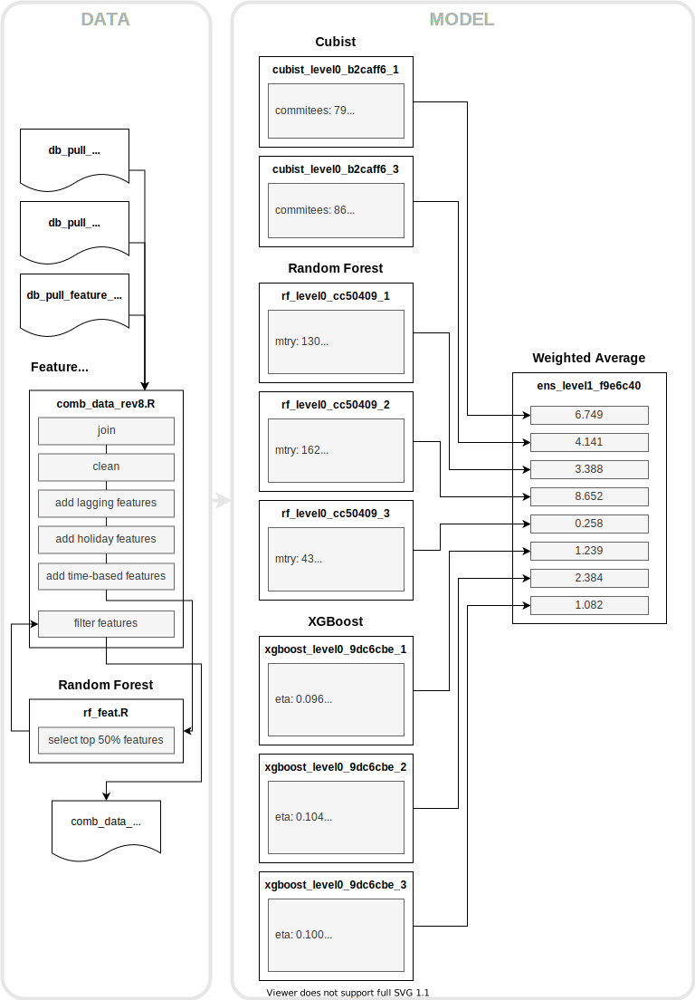

# CAISO Wind Energy Forecasting

This repository is about using machine learning to forecast the amount of wind energy in the California electricity 
grid. With regards to the typical data science workflow, the repository covers modeling and limited feature engineering.

This project is executed in [R](https://www.r-project.org/), using the 
[Modeltime](https://business-science.github.io/modeltime/) library for modeling, and [MLFlow](https://mlflow.org/) for 
tracking experiments.

## Repository Structure

- [data](./data) – Data used or produced in the modeling process
  - [raw](./data/raw) – Raw data (see [below](#about-the-data))
  - [processed](./data/processed) – Processed data
- [docs](./docs) – Documentation
- [models](./models) – Trained models
  -[ens_level1_f9e6c40.rds](./models/ens_level1_f9e6c40.rds) – Final, trained ensemble model (see [below](#model-overview))
- [notebooks](./notebooks) – Notebooks for experiments and analyses
  - [ext](./notebooks/ext) – Notebooks used in external environments, for example for large-scale training in the cloud
  - [analyze_performance.rmd](./notebooks/analyze_performance.rmd) ([HTML](./notebooks/analyze_performance.nb.html)) – Analysis of model performance
- [src](./src) – Source code for building models
  - [data](./src/data) – Source code for ETL process
  - [feature_engineering](./src/feature_engineering)
  - [models_hyperparam_tuning](./src/models_hyperparam_tuning)
  - [models_training](./src/models_training)
  - [util](./src/util) – Utility code related to building models
- [util](./util) – Utility tools
  - [mlflow](./util/mlflow) – Data related to MLFlow
    - [mlruns](./util/mlflow/mlruns) – MLFlow data directory
    - [static](./util/mlflow/static) – Static export of tracked MLFlow experiments
    - [Dockerfile](./util/mlflow/Dockerfile) – Dockerfile for running MLFlow server
    - [environment.yml](./util/mlflow/environment.yml) – Conda environment file to create MLFlow environment

## Model Overview

## About the Data

All data have been acquired and aggregated by the author from public sources. Three datasets are available to aid the 
forecasting effort:

- `db_pull_production_data_raw_20201208.csv` – 5-min time series data stating energy in the California grid by energy 
  source, according to [CAISO](http://www.caiso.com/TodaysOutlook/Pages/supply.aspx). Columns `Time` and `Wind` are
  relevant for this analysis. `Wind` is what we are trying to forecast.
  
- `db_pull_weather_data_raw_20201208.csv` – 1-hour weather time series data at 10 key locations for renewable energy
  generation (wind, solar) in California. The author determined these locations based on geospatial analysis of 
  renewable energy assets in the state, an analysis that is outside the scope of this repository. Columns starting with
  `0_` through `4_` belong to wind-generating locations, ordered in descending order of generating capacity. This 
  dataset can be used to create features for the model. Weather data have been acquired from 
  [Dark Sky](https://darksky.net).
  
- `db_pull_feature_gross_production_20201209.csv` - 1-hour time series dataset with domain-informed features at 10 key
  locations (see above). The author generated the wind-related features (`0_wind` through `4_wind`) by combining weather
  and turbine power curve information. From the weather information above, the author generated air density and hub
  height adjusted estimates of the available wind energy. That information was fed through an assumed power curve and
  multiplied by the assumed total capacity available at that key location. That analysis is outside the scope of this 
  repository, but the generated features can be used for modelling.

## The Problem in Detail

26 hr horizon (Weather forecast)

cubist https://www.google.com/url?sa=t&rct=j&q=&esrc=s&source=web&cd=&cad=rja&uact=8&ved=2ahUKEwi-z97BosfuAhWSKDQIHU-tCTYQFjAPegQIAhAC&url=https%3A%2F%2Fmax-kuhn.squarespace.com%2Fs%2Fcubist_BRUG.pdf&usg=AOvVaw09sS1p66MFBGT49BdYpGzy

## License

